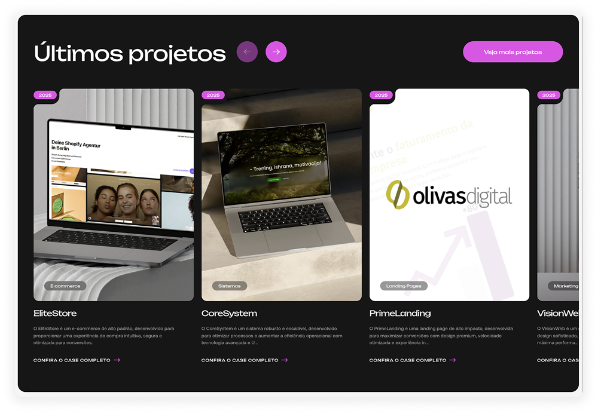
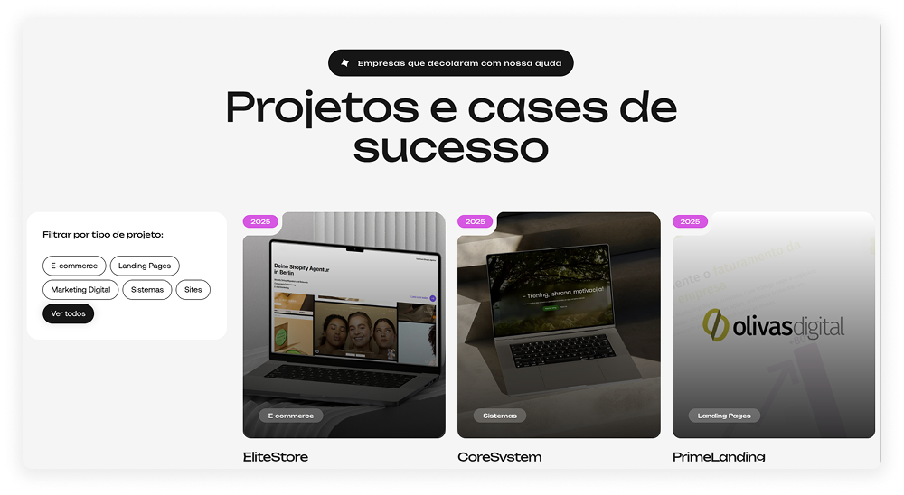
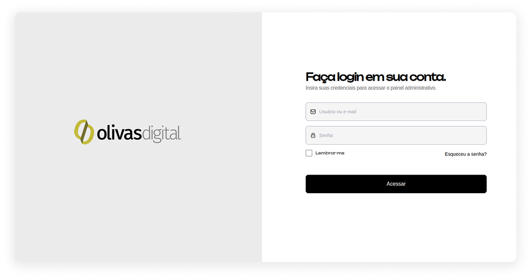
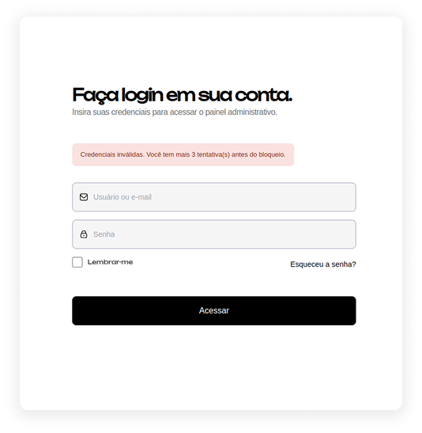
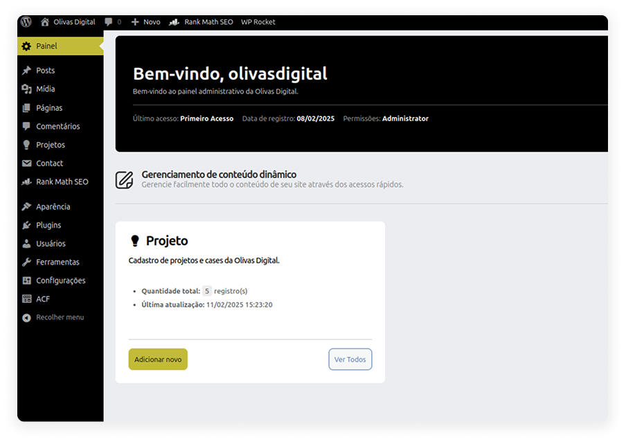

# Olivas.Digital - Guia de configuração

Este guia fornece um passo a passo detalhado para configurar e executar um projeto WordPress que utiliza Gulp para automação de tarefas, incluindo compilação de SCSS, minificação de arquivos CSS e JavaScript, e recarregamento automático com BrowserSync.






## ⚙️ Requisitos

Antes de iniciar, certifique-se de ter instalado:

1. **Node.js e npm**: Necessários para executar o Gulp.
2. **Gulp CLI**: Para executar as tarefas automatizadas.
3. **Servidor local**: Como XAMPP, WAMP, Laragon ou qualquer outro compatível com WordPress.
4. **Banco de dados**: O banco de dados do WordPress está localizado na pasta principal do projeto.
5. **WordPress**: Instalado no ambiente local.

## 📦 Instalação do Gulp e Dependências

1. Instale o Gulp globalmente, se ainda não o tiver:

   ```sh
   npm install -g gulp-cli
   ```

2. Instale as dependências do projeto:

   Certifique-se de estar localizado na pasta raiz do tema, e rode o seguinte comando:

   ```sh
   npm install
   ```

Plugins utilizados no projeto:

1. Advanced Custom Fields (ACF) (obrigatório)

2. Contact Form 7 (obrigatório)

3. WPExpress (obrigatório)

4. WP Rocket (opcional)

## 📁 Estrutura do Projeto

```
olivasdigital/
├── admin/                               # Arquivos de customização do painel e login
├── ajax/filter-projects.php             # Configuração de requisições ajax para o CPT 'projects'
├── custom/                              # Arquivos de actions/filters e config. do Contact Form 7
├── dist/                                # Arquivos compilados que serão carregados no front
│   ├── css/                             # Arquivos CSS processados
│   ├── js/                              # Arquivos JS minificados
├── src/                                 # Códigos fonte
│   ├── scss/                            # Arquivos SCSS
│   ├── js/                              # Scripts JS personalizados
│   ├── js/libraries/                    # Bibliotecas JS
├── templates/                           # Diretório raiz para templates
│   ├── pages/                           # Contém as páginas do projeto
│   ├── partials/                        # Contém templates para uso geral
├── gulpfile.js                          # Configurações do Gulp
├── package.json                         # Lista de dependências e scripts npm
```

**Como carregar novos arquivos SCSS ou JS?**
Carregue arquivos SCSS sempre na pasta `/src/scss`. Para arquivos JS, utilize a pasta `/src/js`. Lembre-se de rodar o projeto com o comando `gulp`. Isso garantirá que será feito o minify automaticamente. Não é necessário importar estes arquivos no `functions.php`, pois o Gulp criará apenas um arquivo minifcado que será inserido na pasta `/dist/`.

## 🔧 Configuração do Banco de Dados

O banco de dados do WordPress está localizado na pasta principal do projeto como `olivasdigital.sql`. Para configurá-lo corretamente:

1. **Importe o banco de dados** para o seu servidor local (MySQL ou MariaDB) usando o phpMyAdmin ou linha de comando:
   ```sh
   mysql -u usuario -p senha < database.sql
   ```
2. **Modifique o arquivo **`` conforme seu ambiente:
   ```php
   define('DB_NAME', 'seu_database_name');
   define('DB_USER', 'seu_usuario');
   define('DB_PASSWORD', 'sua_senha');
   define('DB_HOST', 'localhost');
   ```

## 🖥️ Uso do Gulp

### 🛠️ Comandos Principais

**Iniciar o projeto**: Rode o comando abaixo na pasta raiz do tema, onde contém o arquivo `gulpfile.js`

   ```sh
   gulp
   ```

Isso inicia a compilação de SCSS, minifica os arquivos JS e CSS e ativa o BrowserSync para recarregamento automático.

**Dica:** Deixe o comando `gulp` rodando em parelelo ao desenvolvimento para se beneficiar do BrowserSync. A cada atualização de arquivo `.PHP`, `.HTML`, `.SCSS` ou `.JS`, o BrowserSync fará a atualização automática da paǵina. Lembre-se de configurar o BrowserSync _(passo abaixo)_ e utilizar o proxy para acessar o front-end do site, como `localhost:3000` ou `olivasdigital:3000`.

## 📂 Como Funciona o Gulp

O Gulp é uma ferramenta de automação de tarefas que simplifica o desenvolvimento. No projeto, ele realiza as seguintes tarefas:

- **Compila SCSS para CSS**, adiciona prefixos automáticos e minifica os arquivos.
- **Concatena e minifica os scripts JavaScript**, reduzindo o tamanho e melhorando o desempenho.
- **Concatena e minifica bibliotecas JavaScript** para otimizar carregamento.
- **Utiliza o BrowserSync** para recarregar automaticamente a página ao detectar mudanças no código.

## 🔄 Configuração do BrowserSync

O `proxy` no `gulpfile.js` está definido para `olivasdigital`. Caso seu ambiente local tenha outro nome (como localhost), modifique esta linha:

```js
browserSync.init({
    proxy: 'seu-site-local'
});
```

Dessa forma, o Gulp funcionará corretamente no seu ambiente de desenvolvimento.

# 🚀 Personalização

Este projeto contém várias personalizações desenvolvidas para manter a consistência visual entre cada projeto, aumentar a segurança e incluir novas funcionalidades.

### 1. Filters e Actions 

O arquivo `olivasdigital/custom/filters.php` contém diversas funções personalizadas para aprimorar a segurança, remover funcionalidades desnecessárias e otimizar o ambiente WordPress. Ele inclui ajustes na API REST, melhorias na interface administrativa e restrições para maior segurança. Algumas das principais alterações, são:

  1. Customização da mensagem do Rodapé no painel administrativo, para: "Desenvolvido por Olvias.Digital" *(Personalização)*
  2. Desativação de endpoints REST não necessários *(Segurança)*
  3. Restrição de acesso à API REST para usuários autenticados *(Segurança)*
  4. Remoção da versão do WordPress do código fonte *(Segurança)*
  5. Remoção do editor Gutenberg e ativação do editor clássico *(Personalização)*
  6. Remoção de widgets desnecessários no painel (poluição visual) *(Personalização)*
  7. Alteração de mensagens de erro no login, para uma mensagem genérica *(Segurança)*
  8. *Entre outras funções...*

PS: Estas funções podem ser removidas ou alteradas a depender da necessidade de cada projeto.

### 2. Páginas de "Login" e "Esqueci minha Senha" personalizadas



Este projeto contém páginas personalizadas para "Login" e "Esqueci minha senha", com logotipo e cores da Olivas.Digital. O que pode ser alterado para adaptar para cada cliente.
Isso aumenta a geração de valor e garante um projeto totalmente customizado para o cliente.

### 3. Segurança para autenticação



Foi implementado um sistema de proteção para autenticação inválidas, o que inibe acessos do mesmo IP para quando houver mais de 4 tentativas **inválidas** de login. A lógica foi feita criando `transient` no banco de dados para armazenar temporariamente o IP destes usuários e manter o bloqueio por 15 minutos.

### 4. Dashboard personalizado



Dashboard totalmente personalizado, onde substitui o "Painel" padrão do WordPress, onde ficam widgets. Este Dashboard exibe um acesso rápido para todos os **CPTs** e **Páginas de Opções** criadas pelo ACF.

# 🎯 Google Page Speed

Confira as métricas de Desempenho, Práticas Recomendadas, SEO e Acessibilidade pelo Google Page Speed.

**Mobile:** Desempenho para celulares/tablets usando rede móvel.


**Desktop:** Desempenho para computadores.


Acesso ao relatório completo: https://pagespeed.web.dev/analysis/https-olivasdigital-camargoweb-com-br/das2wfoo8j?form_factor=mobile

# 🏁 Veja o projeto em execução!

Este projeto está temporariamente disponível em um servidor online. Acesse agora e acompanhe em tempo real! 🚀

https://olivasdigital.camargoweb.com.br/
_______

Copyright (C) 2025 João Camargo

Todos os direitos reservados.

Este código-fonte é propriedade do autor original. Nenhuma parte deste código pode ser reproduzida, distribuída ou utilizada de qualquer forma sem permissão expressa por escrito do autor.